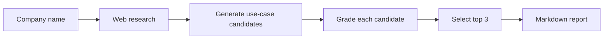

# Sparkstral

A Mistral Workflows worker that takes a company name and returns a client-ready report with 3 high-impact GenAI use cases tailored to that company.

## How it works



Each step runs as a Mistral Workflows activity. The grading evaluates candidates on iconicness, GenAI fit, business impact, company relevance, feasibility, and evidence strength — then picks the three highest-scoring ones for the final report.

## Quick start

```bash
cp .env.example .env          # then fill in your MISTRAL_API_KEY
make up                        # build & start the worker (Docker)
make logs                      # follow output
```

The default config uses Mistral's built-in web search (`WEB_SEARCH_PROVIDER=mistralai`), so the only required key is `MISTRAL_API_KEY`. Serper and Tavily are supported as alternative search providers — see `.env.example`.

Once the worker is running, trigger the workflow from [Le Chat](https://chat.mistral.ai) or the Mistral Console with:

```json
{"company_name": "Veolia"}
```

## Local development (without Docker)

```bash
cd workflow_worker
uv sync
uv run python -m src.worker
```

## Quality checks

```bash
make check   # runs format, lint, typecheck, and test
```

## Example outputs

See the [`examples/`](examples/) folder for sample reports generated by the pipeline (Veolia, Mistral AI, Thales).
