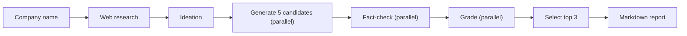

# Sparkstral

A [Mistral Workflows](https://docs.mistral.ai/capabilities/workflows/) worker that takes a company name and returns a client-ready report with 3 high-impact GenAI use cases tailored to that company.

## How it works



1. **Research** — a web-search agent collects sourced facts about the company (identity, business lines, recent developments, scale figures).
2. **Ideation** — an LLM identifies 5 unique company moats and assigns diverse GenAI angles, rejecting generic ideas upfront.
3. **Generation** — 5 use-case candidates are generated in parallel, each anchored to a distinct moat and grounded in the research.
4. **Fact-check** — each candidate is checked against the research text; unsupported claims are softened or removed.
5. **Grading** — an independent grader scores each candidate on iconicness, GenAI fit, business impact, company relevance, feasibility, and evidence strength.
6. **Selection** — the 3 highest-scoring candidates are picked.
7. **Report** — a structured markdown report is assembled with LLM-written narratives and programmatic tables.

## Quick start

```bash
cp .env.example .env          # then fill in your MISTRAL_API_KEY
make up                        # build & start the worker (Docker)
make logs                      # follow output
```

The default config uses Mistral's built-in web search (`WEB_SEARCH_PROVIDER=mistralai`), so the only required key is `MISTRAL_API_KEY`. Serper and Tavily are supported as alternative search providers — see `.env.example`.

Once the worker is running, trigger the workflow from [Le Chat](https://chat.mistral.ai) or the Mistral Console with:

```json
{"company_name": "Veolia"}
```

## Local development (without Docker)

```bash
cd workflow_worker
uv sync
uv run python -m src.worker
```

## Quality checks

```bash
make check   # runs format, lint, typecheck, and test
```

## Example outputs

See the [`examples/`](examples/) folder for sample reports generated by the pipeline (Veolia, La Banque Postale).
